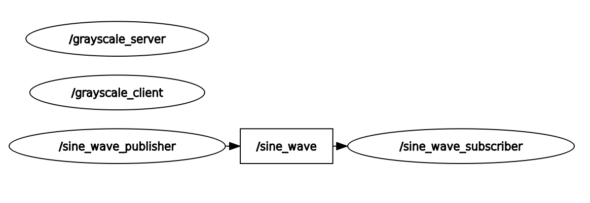

## Project Structure🧱
```
ros2_ws
├── doc/
├── src/
│   ├── customized_interfaces/
│   │   ├── srv/
│   │   │   ├── ImageProcess.srv
│   │   ├── CMakeLists.txt
│   │   ├── package.xml
│   ├── hello_task/
│   │   ├── config/
│   │   │   ├── sine_wave_param.yaml
│   │   │   images/
│   │   │   ├── dog-png-30.png
│   │   ├── include/hello_task/
│   │   │   ├── hello_task.hpp
│   │   ├── launch/
│   │   │   ├── sine_wave_launch.launch.py
│   │   ├── src/
│   │   │   ├── grayscale_client.cpp
│   │   │   ├── grayscale_server.cpp
│   │   │   ├── hello_task_publisher.cpp
│   │   │   ├── hello_task_subscriber.cpp
│   │   ├── test/
|           ├── basic_test.cpp
├── CMakeLists.txt
├── package.xml
├── .clang-format
├── .gitignore
├── Dockerfile
├── README.md
├── task_description.md
```

## Runtime environment🏠
- Operating System: Ubuntu 22.04
- ROS 2 Version: Humble
- Build Tool: Colcon
- Programming Language: C++

## Instructions to run the nodes📋
- source ros humble
```
echo "source /opt/ros/humble/setup.bash" >> ~/.bashrc
source ~/.bashrc
```
- create and source work space
```
mkdir -p ~/ros2_ws/src
cd ~/ros2_ws/src
git clone <your-repo-url>
cd ..
rosdep install --from-paths src --ignore-src -r -y
colcon build --symlink-install
source ~/ros2_ws/install/setup.bash
```
- launch all the nodes
`ros2 launch hello_task sine_wave_launch.launch.py`
- run gtest
`colcon test --ctest-args tests`
## result📚
rqt-graph is shown as below subscriber could sub the `sine_wave` topic and log the value. Dog images is converted to greyscale after running launch file
 


## Run in Docker container🚢
- Build the Docker Image 
`docker build -t bmw_ros2_image .`
- Run the Docker Container 
`docker run -it --rm --net=host --name bmw_ros2_container bmw_ros2_image`
- Inside the container, Source ROS2 workspace:
`source /opt/ros/humble/setup.bash` and `source /bmw_ws/install/setup.bash`

- Launch Nodes: `ros2 launch hello_task sine_wave_launch.launch.py`